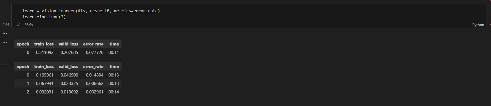
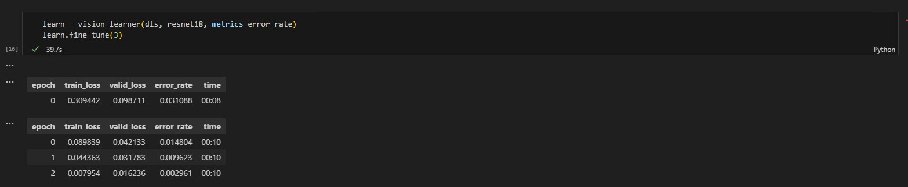
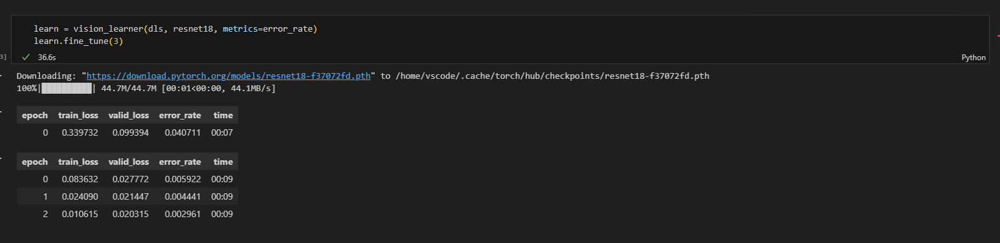
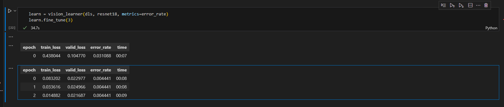
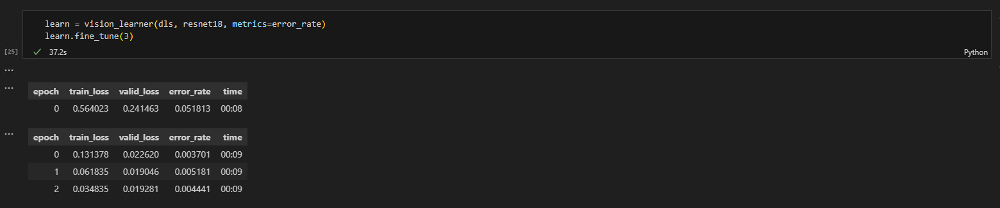
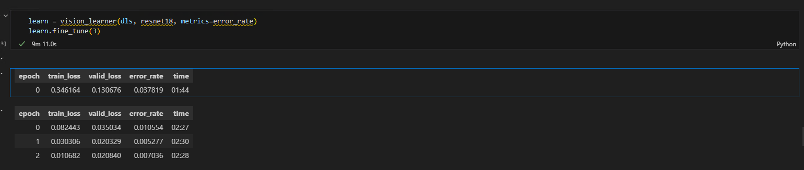
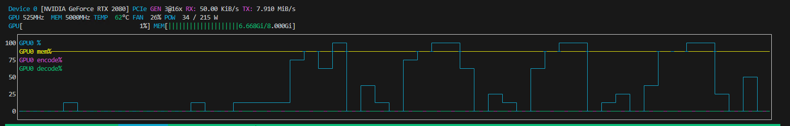

Hello and welcome to this blog I have created for question 2 of ELEC4630 Assignment 2.

## ELEC4630 Assignment 2
Q3. Batch sizes and their run time

bs = 16

bs = 32

bs = 64

bs = 128

bs = 256

CPU

We can conclude the fastest batch size is 128 with a total run time of 34.7s

The maximum speed over of GPU compared to CPU is 8 minutes and 36.3 seconds. 

GPU Utilisation graph

Utilising close to 100% of the GPU.
